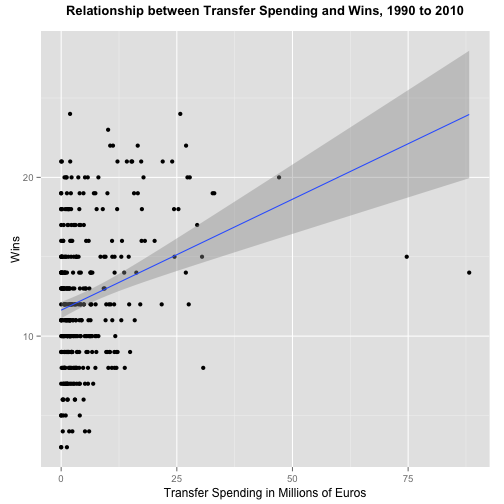

What determines success in the German Bundesliga?
========================================================
author: Ben Piggot
date: October 19, 2014

The Bundesliga Shiny App
========================================================

As the amount of data collected measuring professional sports performance has grown, so too has the desire to use data to identify patterns influencing sporting success. The app this brief presentation describes represents a modest attempt to identify factors that influenced success in one of the world's most competitive soccer leagues, the German Bundesliga. It uses data from the R package [SportsAnalysis](http://cran.r-project.org/web/packages/SportsAnalytics/SportsAnalytics.pdf) to statistically measure factors influencing win totals in the Bundesliga between 1990 and 2010.

Data and Statistical Analysis
========================================================

I combine the BundesligaFinalStandings and BundesligaTransferSums sets from the SportsAnalytics package to provide data this app uses. From this combined data set, I focus on five variables: Wins, Transfer Spending in Millions of Euros, Transfer Income in Millions of Euros, Goals Scored, and Goals Against. The app runs simple linear regressions which measures the relationship betweens wins and one of the four other variables (depending on what the user chooses). 

Previewing the App's Output
========================================================

 
***
The scatterplot to the left is a sample of the app's graphical output. It also provides regression coefficients and measures of statistical signficance as well. To see the fully functioning shiny app, please navigate to: https://benpiggot.shinyapps.io/bundesliga-app/
